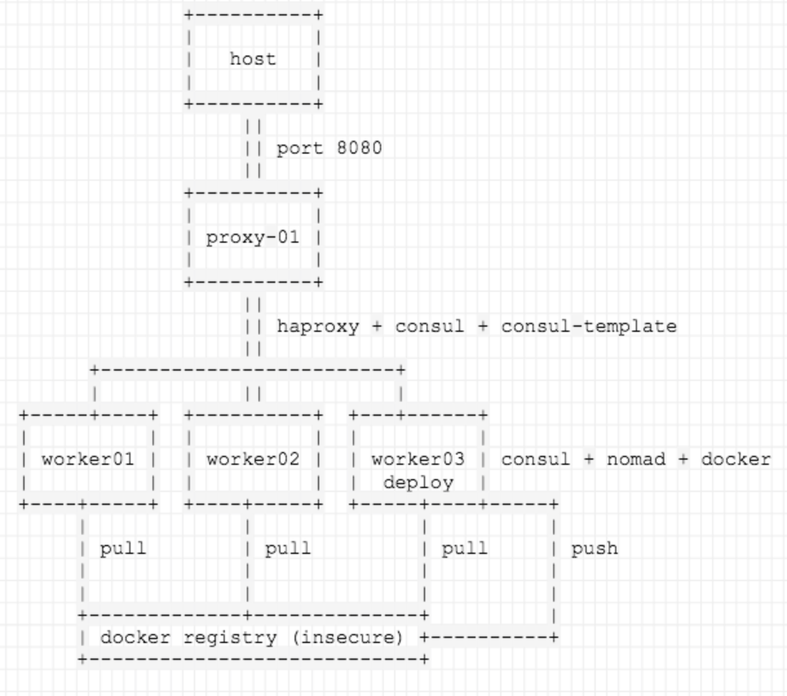
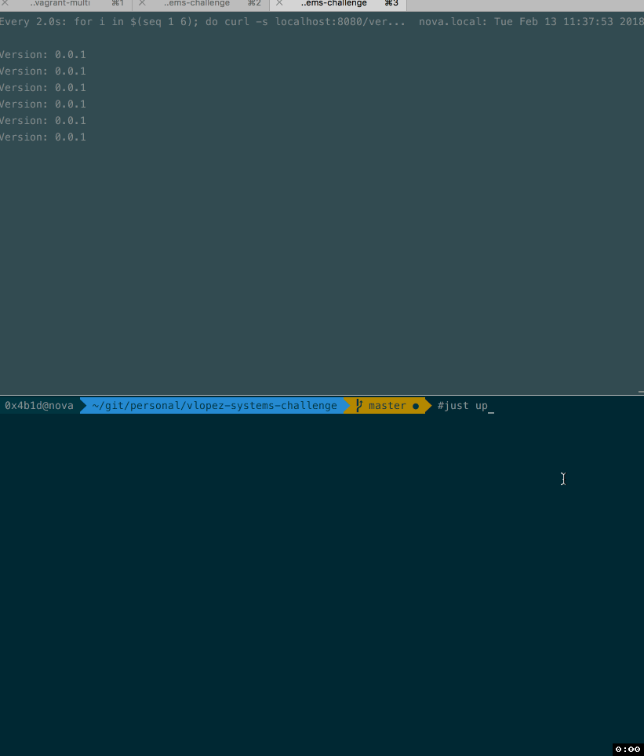

# Solution

### Part 1: Configuration Management

The challenge stack consists of:

- 4 nodes
  - 3 `worker` nodes where the apps can run
    - 1 of the worker nodes has the `deploy` role
  - 1 `proxy` node which will forward the requests to the `app` backend
  
Technologies used:

- `consul` for Service Discovery, as provided in the draft
- `docker` daemon to run the app, as requested in the draft
- `haproxy` for app load balancing, as requested in the draft
- `nomad` for app deployment and HA
- `consul-template` for SD in `HAProxy` and automatic node addition/deletion

In order to deploy the `app` container, I thought about using `docker-compose`, `docker swarm` and `nomad`.

- Using `docker-compose` or `docker swarm` would have been a quick win for creating deployments, but would have increased the complexity to plug them into HAProxy.
- `nomad` integrates seamlessly with `consul`, it's also easy to deploy and configuration is relatively straightforward for simple deployments

Some references I used:

[1] https://attx-project.github.io/Consul-for-Service-Discovery-on-Docker-Swarm.html

[2] https://docs.docker.com/engine/swarm/services/

[3] https://www.nomadproject.io/intro/getting-started/install.html

### Part 2: Questions

#### Identify the SPOFs in the result of the assignment and explain how you would solve them

The architecture diagram of the solution I provided looks like the following:



##### HAProxy
The only SPOF would be the `HAProxy` deployment. I considered making it highly available by using `keepalived` with a couple of `HAProxy` nodes behind a Virtual IP, but I determined it wasn't worth the effort and it would be a bit far away from the scope of the challenge.

##### Consul and Nomad
Both are running in HA mode, with a minimum quorum of `2` which is not ideal, but I thought it was enough for the purpose of the challenge.
Ideally you would want from 3 to 5 nodes in production deployments, as stated in the [bootstrapping documentation](https://www.consul.io/docs/guides/bootstrapping.html).

The same would go for `nomad`.

One last caveat, one every node where `nomad` is deployed, the process is running as both `server` and `agent`, which is discouraged in the [agent configuration](https://www.nomadproject.io/docs/agent/configuration/index.html) section of the documentation, but would make sense for testing environments like this one.

> Note that it is strongly recommended not to operate a node as both client and server, although this is supported to simplify development and testing

##### Docker Registry
The docker registry that is created via `nomad` job is also a SPOF. I didn't think it was worth the effort to set up any kind of shared storage to have more than 1 replica running, so this means that if the registry go down, we cannot deploy new versions of the app.

#### Explain how would you upgrade the Cabify service without downtime

The combination of using [nomad](https://www.nomadproject.io/) with [consul-template](https://github.com/hashicorp/consul-template) seemed like the right choice, considering we needed to deploy [consul](https://www.consul.io/).

The step by step process of deploying a new upgrade of the app would be:

- Change the `cabify_image_tag` variable on the [cabify defaults variables section](roles/cabify/defaults/main.yml).
- That will trigger a new image build [here](roles/cabify/tasks/build_image.yml#L15), which happens [in this step](roles/cabify/tasks/build_image.yml#L17).
- The version would also change the `nomad` [job template](roles/cabify/templates/nomad-jobs/cabify.nomad.j2#L29) image tag, so it will trigger a job deployment [here](roles/cabify/tasks/deploy_image.yml#7).
- The new tagged image will be uploaded to the insecure docker registry.
- After the job is triggered, `nomad` will take care of redeploying the application
- Changes will be registered in `consul` and `consul-template` will pick up the changes from the `consul` catalog and update the `HAProxy` configuration, also triggering a reload of the `HAProxy` process, which will add the new backend nodes as soon as they register into `consul`.

### Part 3: Additional details

- Initial deployment takes roughly ~10 minutes (depending on your internet connection), given that we cannot create the VMs in parallel.
- All the `ansible` playbooks are idempotent, so no further changes will be applied after the first run succeeds.
- I have included two extra routes in the [application file](roles/cabify/templates/app/cabify.py.j2) to be able to get the `hostname` and the current `version` running, for debugging purposes mostly.
- I didn't invest time in adding serverspec tests, but this would be definitely useful to have in a CI pipeline. Which means the `test` directory provided is unusable now.

#### Some caveats

##### Consul and DNS

All services are listening on every node's internal `eth1` interface IP address. The default DNS resolution in vagrant points to the internal DNS of the host, which won't let things work.

I checked the DNS strategies for consul [here](https://www.consul.io/docs/guides/forwarding.html) and decided to go and implement the simplest solution, which would be adding resolvers to `consul` and changing the `resolv.conf` file on every node [here](roles/consul/tasks/configure.yml#L21).

In a production deployment, this should be done differently.

##### Insecure docker registry

In order to be able to pull/push images from/to an insecure docker registry, I had to workaround the `docker` daemon to [trust the insecure registry](roles/docker/tasks/install.yml#L16) that we will be creating afterwards during the provisioning.

##### Ansible tags

On a production deployment, I would leverage the use of [tags](http://docs.ansible.com/ansible/latest/playbooks_tags.html) in order to trigger, for example, just the deployments, or to apply new changes to configuration files, etc...

Using tags with `vagrant` is not natively supported, so you have to [do some workaround](https://medium.com/@shredder/using-ansible-tags-with-vagrant-provision-a4856966a987) and it didn't really add value to the challenge.

#### Some examples

#### Provision the whole cluster

Just run `vagrant up`

The order will be:

1. worker-01
2. worker-02
3. worker-03
4. proxy-01

Ansible first and following runs on a worker node:

```
PLAY RECAP *********************************************************************
worker-01                  : ok=23   changed=20   unreachable=0    failed=0

PLAY RECAP *********************************************************************
worker-01                  : ok=18   changed=0    unreachable=0    failed=0
```

Ansible first and following runs on the deploy node:

```
PLAY RECAP *********************************************************************
worker-03                  : ok=34   changed=29   unreachable=0    failed=0

PLAY RECAP *********************************************************************
worker-03                  : ok=25   changed=0    unreachable=0    failed=0
```

Ansible deployment run:



FYI: The deployment process only happens on `worker-03`

#### Last note

I am still exposing port 8080 on the `proxy-01` node, which means that once that VM is available, we can:

##### Query the container hostname
```
$ curl -s localhost:8080
Hello from 754b50c30b7c!
```

##### Query the application version
```
$ curl -s localhost:8080/version
Version: 0.0.2
```

##### Query the status endpoint
```
$ curl -s localhost:8080/status
OK
```

That's all! It was fun :)